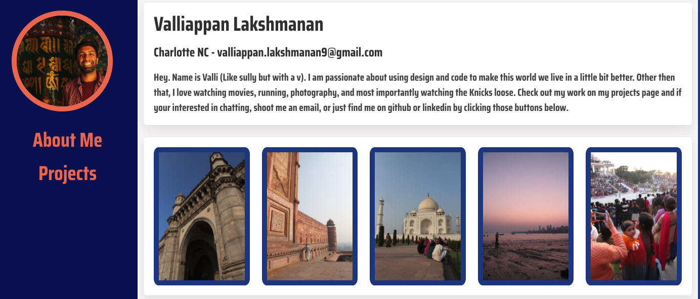

# Responsive Portfolio website

A basic portfolio with links to all my projects, linkedin and git hub pages. I modeled the basic structure of the portfolio off of [this template](https://startbootstrap.com/previews/resume). 

# Technologies used to create

* HTML/CSS
* BULMA CSS framework

# Screenshot of portfolio

# Link to deployed site
[link](https://v-lax.github.io/ResponsivePortfolio/html/main.html)

